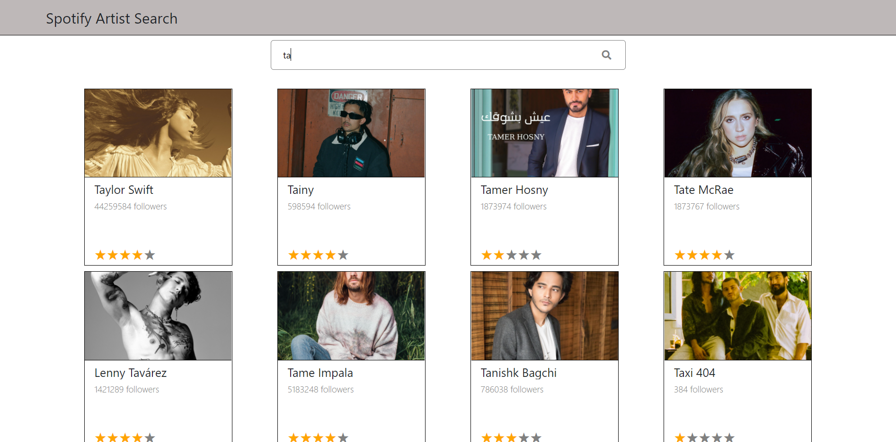

## SpotifyApi

The idea from this project is to filter data form SpotifyApi by allowing the user to search for an artist to retrieve information about his/her albums.

### Built With

* [Node.js](https://nodejs.org/)
* [React.js](https://reactjs.org/)
* [Express.js](https://expressjs.com)

## Project Screen Shots




## Getting Started

### Prerequisites

You will need `node` and `npm` installed globally on your machine.
* npm
  ```sh
  npm install npm@latest -g
  ```

### Installation

1. Clone the repo
   ```sh
   git clone https://github.com/AliOzeir/SpotifyApiTask.git
   ```
2. Install NPM packages on both folders Client and Server
   ```sh
   npm install
   ```
3. Start the Server and the Client folders
   ```sh
   npm start
   ```

## Reflection

This was a 10 hours long project which is made to allow users to filter artists from the Spotify API by typing their name. I started this process by using the `create-react-app` boilerplate, then by adding some essential packages that helped me to develop this small website.

This Single Page Application supports the search-as-you-type feature that triggers a new query whenever the end user types additional text in the search box. In addition, it has an essential feature which allow specific users to access the website without even the need to configure any access parameters.

One of the main challenges I ran into was Authentication. This lead me to spend a few hours on a research spike into OAuth as it was my first time I use this authentication protocol. During my work, I have focused on the small details, as I have followed the test instructions and made sure all the technical specifications are done as ordered.

At the end of the day, the technologies implemented in this project are React, Node, Express, Spotify-Web-Api-Node(A universal client for the Spotify Web API that runs on Node.JS and the browser), and a significant amount of VanillaJS, JSX, and CSS.

## Contact

Ali Ozeir - Contact me on [LinkedIn](https://lb.linkedin.com/in/ozeir) 
Project Link: [https://github.com/AliOzeir/SpotifyApiTask.git](https://github.com/your_username/repo_name)


## Acknowledgments

* [Spotify API](https://developer.spotify.com/documentation/web-api/)
* [GitHub/Spotify-Web-Api-Node](https://github.com/thelinmichael/spotify-web-api-node)
* [React Icons](https://react-icons.github.io/react-icons/search)
